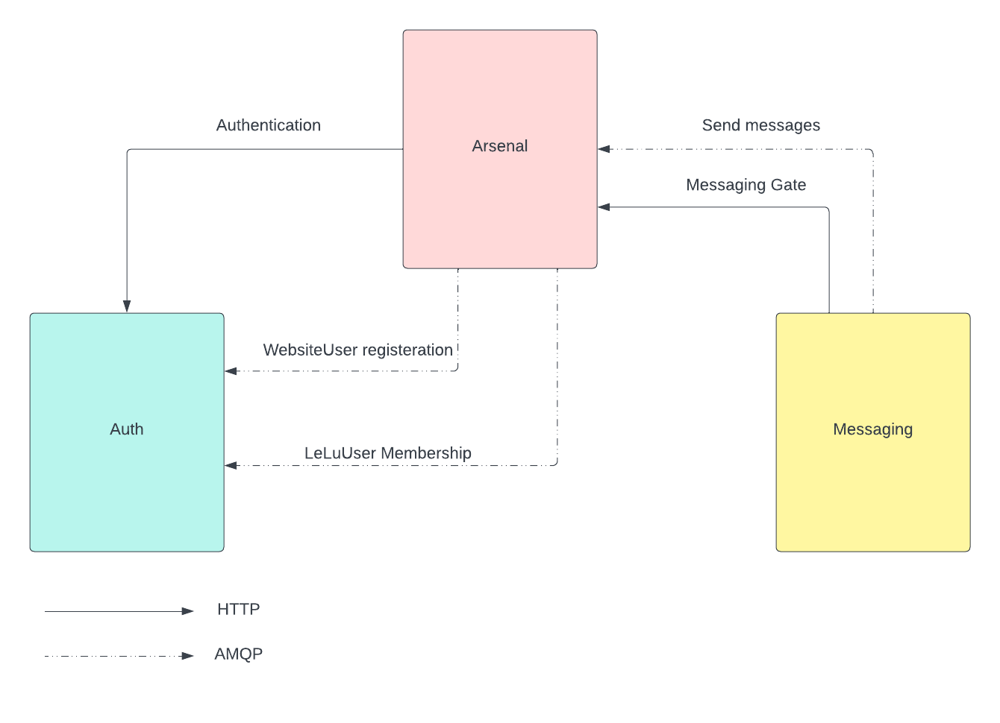

# LeLuChat
LeLuChat provides REST API and Websocket to enable admin users of website to chat with their customers. LeLuChat flow can
be seen [here](docs/LeLuChat_Flow.md).
## Deploy LeLuChat
`docker compose up`

