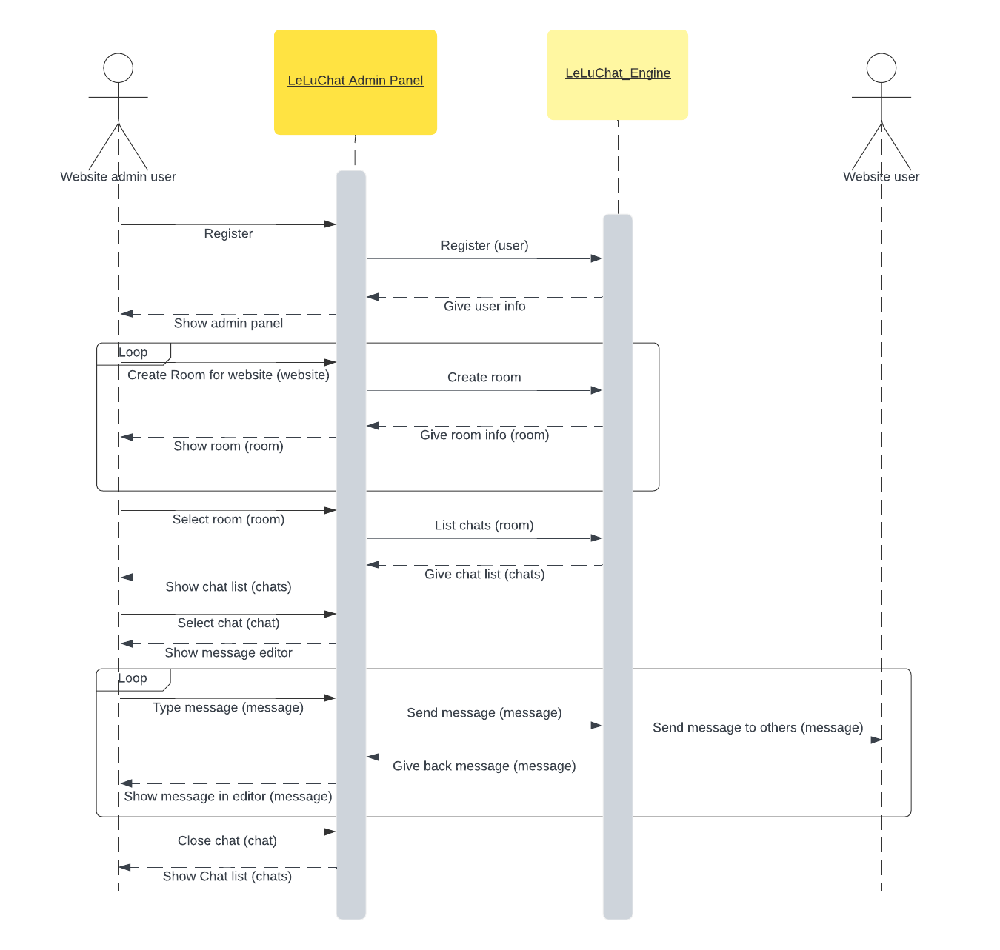
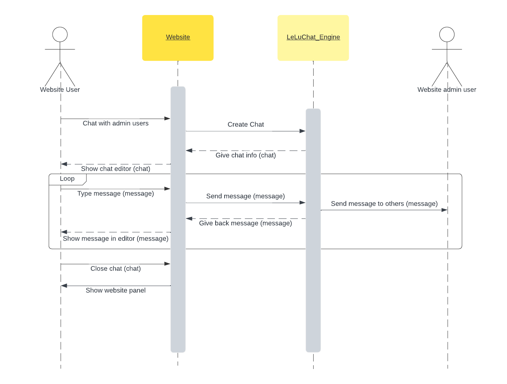

# LeLuChat Flow
To use LeLuChat, admin users of website should register their website in LeLuChat. After that they get unique url, which
other users can use it to chat with them. You can see this process in below sequence uml diagram:

Unique url that given to the admin users can be embedded in to their frontend code of website, so every user of website
can be enabled to chat with admin users. Admin users can see all of that chats and messages in the LeLuChat admin panel.

 
